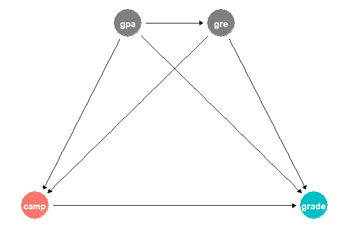
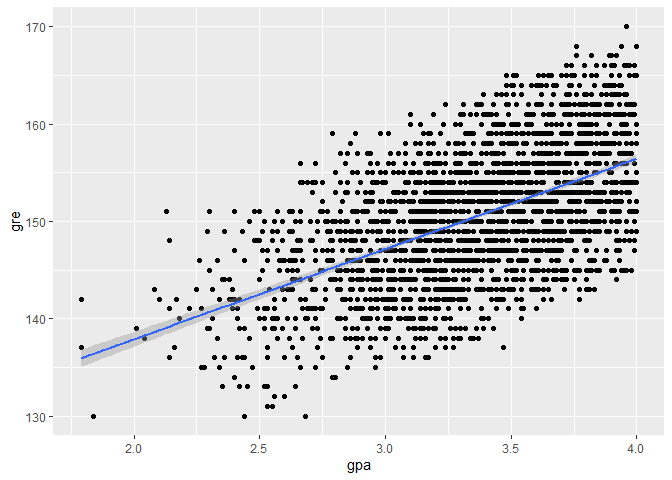
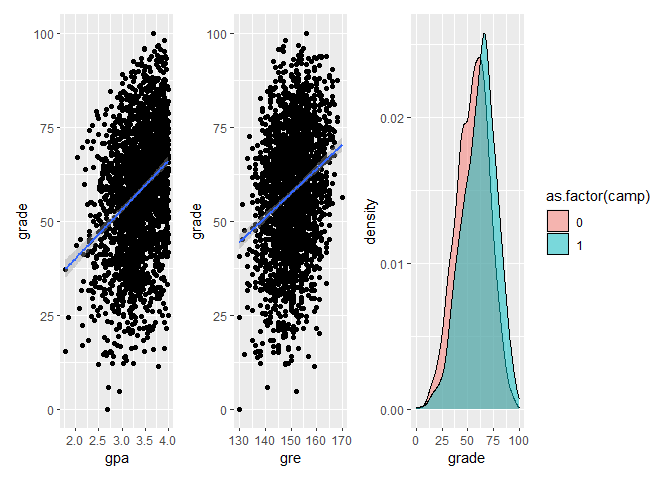

Making Fake Causal Data
================
Lindsey Dorson

------------------------------------------------------------------------

``` r
library(tidyverse)  # For ggplot, mutate(), filter(), and friends
library(broom)      # For converting models to data frames
library(ggdag)      # For drawing DAGs
library(scales)     # For rescaling data with rescale()
library(truncnorm)  # For truncated normal distributions
library(patchwork)
library(modelsummary)
library(magrittr)

set.seed(4660)  
# Turn off the message that happens when you use group_by() and summarize()
options(dplyr.summarise.inform = FALSE)
```

Many MPA and MPP programs offer a brief math camp in the weeks before
students begin their graduate degrees, with the hope that it will help
students by more prepared in math-heavy classes like statistics and
microeconomics.

You’re interested in evaluating the effectiveness of a hypothetical math
camp program. Does attending math camp cause higher grades in statistics
classes?

This program is not randomized and it’s not mandatory—anyone can decide
to sign up (or not!), which means you have selection bias and
confounding to worry about.

You don’t have any data for this, but that’s okay! You can simulate some
data and set up the infrastructure for answering this question later
with real data.

## 1: Draw a DAG that maps out how all the columns you care about are related

For the sake of this example, we’ll think about a DAG with just four
nodes. Students’ GRE scores and undergraduate GPAs confound both the
choice to enroll in math camp and final class grades. Additionally,
undergraduate degrees help cause GRE scores.

``` r
math_camp_dag <- dagify(grade ~ camp + gpa + gre,
                        camp ~ gpa + gre,
                        gre ~ gpa,
                        outcome = "grade",
                        exposure = "camp",
                        coords = list(x = c(camp = 1, gpa = 2, gre = 3, grade = 4),
                                      y = c(camp = 1, gpa = 2, gre = 2, grade = 1)))

ggdag_status(math_camp_dag) +
  theme_dag() +
  guides(color = "none")  # Turn off legend
```



## 2: Specify how those nodes are measured

Here’s how these columns are measured:

-   **GPA**: Scale from 1.5 to 4.0 with two decimals (i.e. values like
    3.54 are fine). Mostly clustered around 3.5, plus or minus some
    amount that you decide. You’ll either want to scale down whatever
    values you create with `rescale()`, or use `rtruncnorm()` to
    constrain the values within the plausible range.
-   **GRE**: Scale from 130 to 170 with no decimals (i.e. values like
    145.32 are bad). Mostly clustered around 150, plus or minus some
    amount that you decide. You’ll either want to scale down whatever
    values you create with `rescale()`, or use `rtruncnorm()` to
    constrain the values within the plausible range.
-   **Math camp**: Binary variable. Roughly 50% of students enroll in
    math camp.
-   **Final grade**: Final exam score in a student’s statistics class.
    Scale from 0 to 100 with one decimal (i.e. values like 75.2 are
    fine), mostly clustered around 70 (it’s a hard test), plus or minus
    some amount that you decide.

## 3: Specify the relationships between the nodes based on the DAG equations

In the DAG, there are three sets of relationships, or models:

-   **GPA is associated with GRE scores**: Every 1 point increase in GPA
    (i.e. moving from a 2.0 to a 3.0) increases GRE scores by 10, on
    average.
-   **Math camp is associated with undergraduate GPA and GRE scores**:
    Math camp here is a binary variable, so you can’t say things like
    “every 1 point increase in GRE scores changes math camp by X”.
    Instead, you’ll want to do something similar to [the example for
    creating an effect in an observational
    DAG](https://evalf21.classes.andrewheiss.com/example/synthetic-data/#creating-an-effect-in-an-observational-dag):
    create a column named `camp_score`, have GPA and GRE *decrease* that
    score (since people are less likely to enroll in math camp if they
    have higher GPAs and GRE scores), rescale that math camp score
    column to be between 0 and 1 to create a `camp_probability` column,
    and then randomly assign people to math camp based on those
    probabilities. I don’t care what the size of the GPA and GRE effects
    are (since they’ll be scaled down and binary-ized anyway)—just make
    it so that the probability of math camp goes down as GPA and GPA go
    up.
-   **Final grade is caused by math camp, undergraduate GPA, and GRE
    scores**: Every 1 point increase in GPA increases final test scores
    by 10 points, on average. Every 1 point increase in GRE scores
    increase final test scores by 0.5 points. *Participating in math
    camp causes a boost of 10 points.* That’s the causal effect you’re
    building in.

## 4: Generate data based on the DAG relationships

Generate random columns that stand alone. Generate related columns using
regression math. Consider adding random noise. This is an entirely trial
and error process until you get numbers that look good. Rely heavily on
plots as you try different coefficients and parameters. Optionally
rescale any columns that go out of reasonable bounds. If you rescale,
you’ll need to tinker with the coefficients you used since the final
effects will also get rescaled.

Generate data for 2500 students.

You’ll probably want to rescale columns so you don’t end up with GPAs
like 6.3, etc. Rescaling distorts the causal effects you build in, so
you probably won’t do something like `10 * camp`—it’ll likely need to be
higher.

``` r
set.seed(4660)


n_people<- 2500


data<-tibble(
  id= 1:n_people,
  gpa = rtruncnorm(n_people,mean = 3.5,sd =.5, a =1.5, b =4),
  gre = rtruncnorm(n_people, mean = 150, sd = 10, a= 130, b= 170),
  camp = rbinom(n_people, size =1, prob= 0.5),
  grade = rbeta(n_people, shape1 = 7, shape2 =4)*100)%>%
  mutate(
    gpa = round(gpa,2),
    gre = round(gre,0),
    camp = factor(camp),
    grade = round(grade,1))

data2<-data %>%
  # generate gre variable
  mutate(gre_with_effect = gre + (16* gpa) + rnorm(n_people, mean =0, sd =2),
         gre_scaled = rescale(gre_with_effect, to = c(130,170)),
         gre = round(gre_scaled,0))%>%
  # generate camp participation
  mutate(camp_score = (-50*gpa)+(-10*gre)+ rnorm(n_people, mean = 0, sd = 2),
         camp_prob = rescale(camp_score, to=c(0,1)),
         camp = rbinom(n_people,1,camp_prob))%>%
  #generate final grade
  mutate(grade_with_effect = grade + (10*gpa)+ (0.5*gre)+ (10*camp) + rnorm(n_people, mean = 0, sd = 2),
         grade_scaled = rescale(grade_with_effect,to=c(0,100)),
         grade = round(grade_scaled,1))
```

## 5: Verify all relationships with plots and models

Make sure the relationships look good. GPA and GRE should be related to
each other. Higher values of GPA and GRE should decrease the likelihood
of math camp. GPA, GRE, and math camp should all be positively related
with final grades.

### GPA on GRE

``` r
ggplot(data2, aes(x = gpa, y = gre)) +
  geom_point() +
  geom_smooth(method = "lm")
```

    ## `geom_smooth()` using formula 'y ~ x'

<!-- -->

``` r
tidy(lm(gre~gpa,data = data2))
```

    ## # A tibble: 2 × 5
    ##   term        estimate std.error statistic   p.value
    ##   <chr>          <dbl>     <dbl>     <dbl>     <dbl>
    ## 1 (Intercept)   119.       0.948     126.  0        
    ## 2 gpa             9.27     0.280      33.1 3.71e-199

Significant relationship is maintained. A one point increase in GPA is
associated with about a 10 point increase in GRE score.

### GPA & GRE on Camp Participation Likelyhood

``` r
tidy(lm(camp_prob ~ gpa + gre, data= data2))
```

    ## # A tibble: 3 × 5
    ##   term        estimate std.error statistic p.value
    ##   <chr>          <dbl>     <dbl>     <dbl>   <dbl>
    ## 1 (Intercept)   3.74   0.00177       2115.       0
    ## 2 gpa          -0.0987 0.000231      -426.       0
    ## 3 gre          -0.0197 0.0000138    -1429.       0

Significant and negative relationship maintained between both GPA and
GRE on camp likelyhood.

### Final Grades

``` r
grade_gpa<-ggplot(data2, aes(x = gpa, y = grade)) +
  geom_point() +
  geom_smooth(method = "lm")

grade_gre<-ggplot(data2, aes(x = gre, y = grade)) +
  geom_point() +
  geom_smooth(method = "lm")

grade_camp<-ggplot(data2, aes(x = grade, fill = as.factor(camp))) +
  geom_density(alpha=0.5)


grade_gpa + grade_gre + grade_camp
```

    ## `geom_smooth()` using formula 'y ~ x'
    ## `geom_smooth()` using formula 'y ~ x'

<!-- -->

GPA, GRE, and Camp participation all positively affect final grades.

## 6: Try it out!

See if you can find the effect. Run two models:

-   `grade ~ camp`: This is the naive, unadjusted,
    correlation-is-not-causation estimate. It’s wrong.
-   `grade ~ camp + gpa + gre`: This is the adjusted estimate. Backdoors
    have been closed and the coefficient for `camp` should be the causal
    effect. It should be around 10.

``` r
naive_model<-lm(grade~camp, data =data2)
adjusted_model<-lm(grade ~ camp + gpa + gre, data = data2)

modelsummary(list("Niave" = naive_model,
                  "Adjusted"= adjusted_model),
             stars = TRUE)
```

    ## Warning in !is.null(rmarkdown::metadata$output) && rmarkdown::metadata$output
    ## %in% : 'length(x) = 4 > 1' in coercion to 'logical(1)'

|             |    Niave     |   Adjusted    |
|:------------|:------------:|:-------------:|
| (Intercept) | 54.828\*\*\* | -65.489\*\*\* |
|             |   (0.434)    |    (7.097)    |
| camp        | 6.520\*\*\*  | 10.869\*\*\*  |
|             |   (0.648)    |    (0.621)    |
| gpa         |              | 11.041\*\*\*  |
|             |              |    (0.877)    |
| gre         |              |  0.540\*\*\*  |
|             |              |    (0.054)    |
| Num.Obs.    |     2500     |     2500      |
| R2          |    0.039     |     0.209     |
| R2 Adj.     |    0.039     |     0.208     |
| AIC         |   20995.9    |    20513.0    |
| BIC         |   21013.3    |    20542.1    |
| Log.Lik.    |  -10494.927  |  -10251.512   |
| F           |   101.330    |    219.873    |
| RMSE        |    16.10     |     14.61     |

**Note:** ^^ + p \< 0.1, \* p \< 0.05, \*\* p \< 0.01, \*\*\* p \< 0.001
When we control for confounders, we get close to the 10 point ATE we
were trying to simulate between camp participation and final grades.
Without adjustment, we find that camp participation causes only a 6.5
increase in final grades.

## 7: Save the data

Make a version of your fake data that removes all the intermediate
columns you made. Save the final clean data as a CSV file with
`write_csv()`.

``` r
data_final<- data2 %>%
  select(id,gpa,gre,camp_prob,camp)
write_csv(data_final, "data/camp_final.csv")
```
